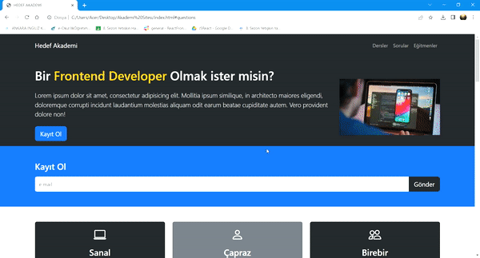

<h1> Akademi Sitesi / Academy Site </h1>

Projemde bir akademi merkezine ait web sitesi tasarımı üzerine çalıştım. Liste şekline gelebilen navbara "kayıt ol", "dersler", "sorular"  "eğitmenler" butonları ekledim ve yönlendirdim. Kayıt formu oluşturdum. Sayfanın en alt kısmına ise akademinin bilgilerini ve Google maps aracılığı ile konum bilgisini ekledim.    

In my project, I worked on the website design of an academy center. I added "register", "lessons", "questions" and "instructors" buttons to the list-shaped navbar and directed them. I created a registration form. I added the academy's information and location information via Google maps at the bottom of the page.

<h1> Kullandığım Teknolojiler </h1>
Projemde HTML, CSS ve JS kodları ile bootstrap kullandım.    
I used bootstrap with HTML, CSS and JS codes in my project.

<h2> Ekran Görüntüsü </h2>
